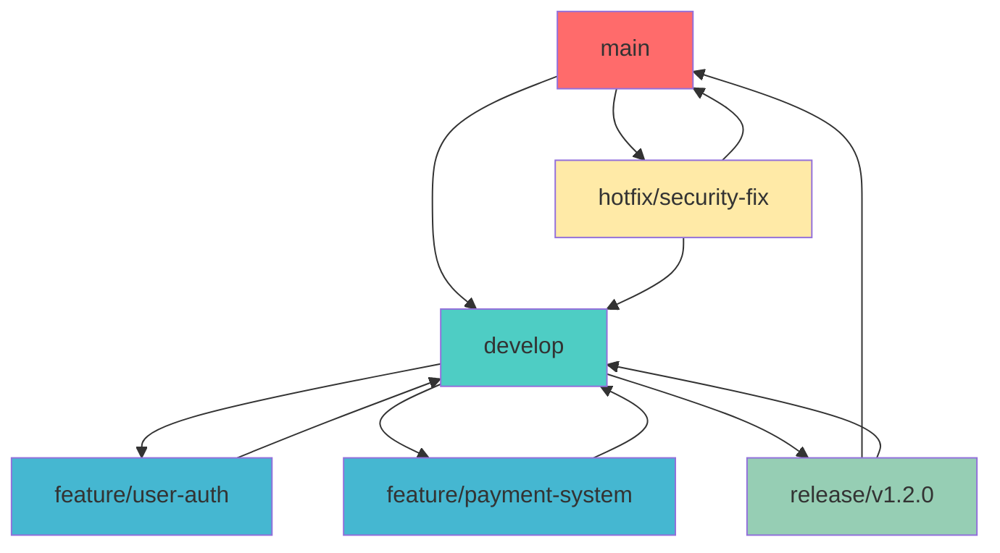
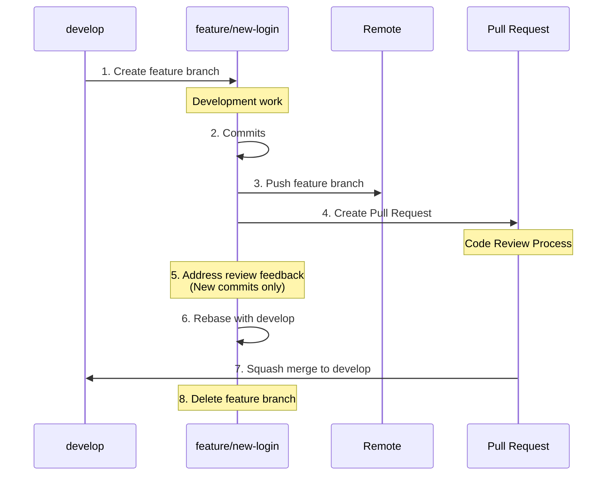
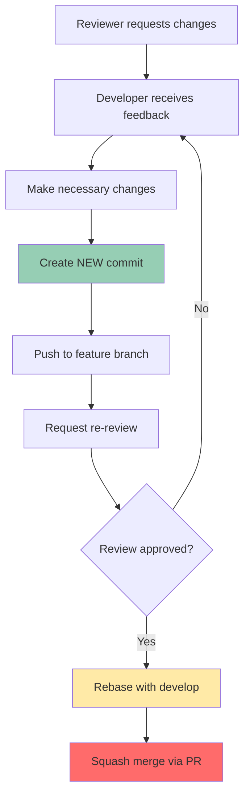
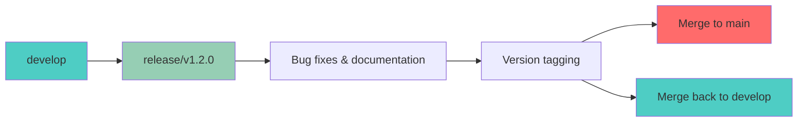
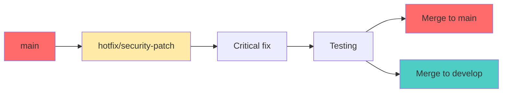

# Git Workflow Implementation Guide

## Table of Contents

1. [Architecture & Branch Strategy](#architecture--branch-strategy)
2. [Implementation Guide](#implementation-guide)
3. [Workflow Visualization](#workflow-visualization)
4. [Best Practices](#best-practices)
5. [Command Reference](#command-reference)

### When to Use GitFlow

**Recommended for:**
- Projects with scheduled release cycles
- Teams requiring formal release processes
- Environments with strict quality gates
- Large teams with complex feature coordination
- Products requiring maintenance of multiple versions

**Consider alternatives for:**
- Continuous deployment environments
- Small teams with frequent releases
- Projects requiring rapid iteration

## Architecture & Branch Strategy

### Core Branch Types

| Branch Type | Purpose | Base Branch | Merge Target | Lifecycle |
|-------------|---------|-------------|--------------|-----------|
| `main` | Production releases | N/A | N/A | Permanent |
| `develop` | Integration branch | `main` | `main` | Permanent |
| `feature/*` | New features | `develop` | `develop` | Temporary |
| `release/*` | Release preparation | `develop` | `main` + `develop` | Temporary |
| `hotfix/*` | Critical fixes | `main` | `main` + `develop` | Temporary |

### Branch Hierarchy



## Implementation Guide

### Initial Repository Setup

#### 1. Initialize GitFlow Structure

```bash
# Clone or navigate to your repository
git clone <repository-url>
cd <repository-name>

# Create and setup develop branch
git checkout main
git checkout -b develop
git push -u origin develop

# Set up branch tracking
git branch --set-upstream-to=origin/develop develop
```

#### 2. Configure Branch Protection

For enterprise environments, configure branch protection rules:

```bash
# Example branch protection configuration
# (Typically done through Git hosting platform UI)
- main: Require PR reviews, status checks, no direct pushes
- develop: Require PR reviews, allow force push for maintainers only
```

### Feature Development Workflow

#### Feature Branch Lifecycle



#### Implementation Steps

```bash
# 1. Start new feature (ALWAYS from develop)
git checkout develop
git pull origin develop
git checkout -b feature/user-authentication

# 2. Develop and commit
git add .
git commit -m "feat: implement OAuth2 authentication"

# 3. Push and create pull request
git push -u origin feature/user-authentication
# Create Pull Request through Git hosting platform UI

# 4. During code review - if changes requested
# ❌ NEVER force push: git push --force
# ✅ ALWAYS create new commits for changes
git add .
git commit -m "fix: address code review feedback - add input validation"
git push origin feature/user-authentication

# 5. Before merge - rebase with latest develop
git fetch origin
git rebase origin/develop
# Resolve any conflicts if they exist
git push origin feature/user-authentication

# 6. Squash merge through Pull Request UI
# (Done by reviewer/maintainer with merge permissions)

# 7. Cleanup after merge
git checkout develop
git pull origin develop
git branch -d feature/user-authentication
git push origin --delete feature/user-authentication
```

#### Pull Request Guidelines

##### 🔄 **Mandatory Pull Request Process**

All feature branches **MUST** go through Pull Request review before merging to `develop`:

1. **Create PR immediately** after pushing feature branch
2. **Assign reviewers** (minimum 1 team members)
3. **Link related issues** or user stories
4. **Add descriptive title** and detailed description

##### 📝 **Pull Request Template**

```markdown
## Description
Brief description of changes and motivation

## Type of Change
- [ ] Bug fix
- [ ] New feature
- [ ] Breaking change
- [ ] Documentation update

## Testing
- [ ] Unit tests added/updated
- [ ] Integration tests pass
- [ ] Manual testing completed

## Checklist
- [ ] Code follows style guidelines
- [ ] Self-review completed
- [ ] Comments added for complex logic
- [ ] Documentation updated
```

##### ⚠️ **Critical Review Rules**

| Rule | Description | ✅ Correct | ❌ Incorrect |
|------|-------------|------------|--------------|
| **No Force Push** | Never force push when PR has review comments | `git commit -m "fix: address feedback"` | `git push --force` |
| **New Commits for Changes** | Address feedback with new commits, not amends | `git commit --amend` then new commit | `git commit --amend && git push --force` |
| **Rebase Before Merge** | Always rebase with develop before final merge | `git rebase origin/develop` | Direct merge without rebase |
| **Squash Merge Only** | Use squash merge to maintain clean history | Squash merge via UI | Regular merge commit |

##### 🔄 **Handling Request Changes Workflow**



#### Detailed Step-by-Step Process

##### Phase 1: Feature Development

```bash
# 1. Ensure you're on latest develop
git checkout develop
git pull origin develop

# 2. Create feature branch with descriptive name
git checkout -b feature/payment-gateway-integration

# 3. Implement your feature with good commit practices
git add src/payment/
git commit -m "feat: add payment gateway service integration"

git add tests/payment/
git commit -m "test: add payment gateway unit tests"

git add docs/
git commit -m "docs: update API documentation for payment endpoints"
```

##### Phase 2: Pull Request Creation

```bash
# 4. Push feature branch to remote
git push -u origin feature/payment-gateway-integration

# 5. Create Pull Request via web interface
# - Title: "feat: implement payment gateway integration"
# - Description: Use template above
# - Assign reviewers
# - Link to related issues
```

##### Phase 3: Code Review Process

```bash
# When reviewers request changes:

# ❌ WRONG - Don't do this:
git commit --amend -m "Updated message"
git push --force origin feature/payment-gateway-integration

# ✅ CORRECT - Do this instead:
git add .
git commit -m "fix: address code review - improve error handling"
git push origin feature/payment-gateway-integration

# For multiple review rounds:
git add .
git commit -m "refactor: optimize payment validation logic per review"
git push origin feature/payment-gateway-integration
```

##### Phase 4: Final Integration

```bash
# Before final merge, rebase with latest develop
git fetch origin
git rebase origin/develop

# If conflicts occur during rebase:
# 1. Resolve conflicts in affected files
# 2. Stage resolved files: git add <file>
# 3. Continue rebase: git rebase --continue
# 4. Push updated branch: git push origin feature/payment-gateway-integration

# Final squash merge is done through PR interface by maintainer
```

#### Branch Management Rules

##### ✅ **Required Practices**

- **Source Branch**: Feature branches MUST be created from `develop`
- **PR Requirement**: ALL features require Pull Request approval
- **Review Count**: Minimum 2 approvals required
- **Rebase Requirement**: Must rebase with `develop` before merge
- **Merge Strategy**: ONLY squash merge allowed for features
- **History Preservation**: Never force push during review process

##### ❌ **Prohibited Actions**

- Direct commits to `develop` branch
- Force pushing feature branches with active PRs
- Merging without rebase
- Using regular merge commits for features
- Bypassing code review process

#### Squash Merge Configuration

For maintainers configuring repository settings:

```bash
# GitHub Settings:
# - Allow squash merging: ✅ Enabled
# - Allow merge commits: ❌ Disabled for features
# - Allow rebase merging: ❌ Disabled for features
# - Automatically delete head branches: ✅ Enabled

# GitLab Settings:
# - Squash commits when merging: ✅ Require
# - Delete source branch after merge: ✅ Enabled
```

### Release Management Workflow

#### Release Branch Process



#### Implementation Steps

```bash
# 1. Create release branch
git checkout develop
git pull origin develop
git checkout -b release/v1.2.0

# 2. Release preparation
# - Update version numbers
# - Update CHANGELOG.md
# - Final testing and bug fixes

# 3. Finalize release
git checkout main
git pull origin main
git merge --no-ff release/v1.2.0
git tag -a v1.2.0 -m "Release version 1.2.0"

# 4. Merge back to develop
git checkout develop
git merge --no-ff release/v1.2.0

# 5. Push changes
git push origin main --tags
git push origin develop

# 6. Cleanup
git branch -d release/v1.2.0
git push origin --delete release/v1.2.0
```

### Hotfix Workflow

#### Critical Production Fixes



#### Implementation Steps

```bash
# 1. Create hotfix branch from main
git checkout main
git pull origin main
git checkout -b hotfix/security-vulnerability

# 2. Implement fix
git add .
git commit -m "fix: resolve critical security vulnerability"

# 3. Merge to main
git checkout main
git merge --no-ff hotfix/security-vulnerability
git tag -a v1.2.1 -m "Hotfix version 1.2.1"

# 4. Merge to develop
git checkout develop
git merge --no-ff hotfix/security-vulnerability

# 5. Push changes
git push origin main --tags
git push origin develop

# 6. Cleanup
git branch -d hotfix/security-vulnerability
```

## Workflow Visualization

### Complete GitFlow Lifecycle

```mermaid
gitgraph
    commit id: "Initial"
    branch develop
    checkout develop
    commit id: "Setup"
    
    branch feature/auth
    checkout feature/auth
    commit id: "Auth v1"
    commit id: "Auth v2"
    
    checkout develop
    merge feature/auth
    commit id: "Integrate auth"
    
    branch feature/payment
    checkout feature/payment
    commit id: "Payment v1"
    
    checkout develop
    branch release/v1.0
    checkout release/v1.0
    commit id: "RC1"
    commit id: "Bug fixes"
    
    checkout main
    merge release/v1.0
    commit id: "v1.0" tag: "v1.0"
    
    checkout develop
    merge release/v1.0
    merge feature/payment
    
    checkout main
    branch hotfix/critical
    checkout hotfix/critical
    commit id: "Hotfix"
    
    checkout main
    merge hotfix/critical
    commit id: "v1.0.1" tag: "v1.0.1"
    
    checkout develop
    merge hotfix/critical
```

## Best Practices

### Branch Naming Conventions

```bash
# Features
feature/user-authentication
feature/payment-integration
feature/dashboard-redesign

# Releases
release/v1.2.0
release/v2.0.0-beta

# Hotfixes
hotfix/security-patch
hotfix/critical-bug-fix
```

### Commit Message Standards

Follow conventional commit format:

```bash
feat: add OAuth2 authentication system
fix: resolve payment gateway timeout issue
docs: update API documentation
test: add unit tests for user service
refactor: optimize database queries
```

### Code Review Guidelines

1. **Feature Branches**: Require 2+ approvals before merging to develop
2. **Release Branches**: Require senior developer approval
3. **Hotfix Branches**: Emergency approval process with post-review

### Version Management

```bash
# Semantic versioning: MAJOR.MINOR.PATCH
v1.0.0  # Initial release
v1.1.0  # New features
v1.1.1  # Bug fixes
v2.0.0  # Breaking changes
```

## Command Reference


#### Repository Initialization
```bash
# Initialize repository with GitFlow structure
git checkout main
git checkout -b develop
git push -u origin develop
```

#### Feature Workflow Commands
```bash
# Start new feature
git checkout develop
git pull origin develop
git checkout -b feature/<feature-name>

# Work on feature (multiple commits allowed)
git add .
git commit -m "feat: implement feature component"
git add .
git commit -m "test: add feature unit tests"

# Push feature branch for PR
git push -u origin feature/<feature-name>

# Before merge: rebase with develop
git fetch origin
git rebase origin/develop
git push origin feature/<feature-name>

# After squash merge via PR: cleanup
git checkout develop
git pull origin develop
git branch -d feature/<feature-name>
git push origin --delete feature/<feature-name>
```

#### Release Workflow Commands
```bash
# Start release branch
git checkout develop
git pull origin develop
git checkout -b release/<version>

# Release preparation work
git add .
git commit -m "chore: bump version to <version>"
git add .
git commit -m "docs: update CHANGELOG for <version>"

# Finalize release
git checkout main
git pull origin main
git merge --no-ff release/<version>
git tag -a <version> -m "Release <version>"

# Merge back to develop
git checkout develop
git pull origin develop
git merge --no-ff release/<version>

# Push all changes
git push origin main --tags
git push origin develop

# Cleanup
git branch -d release/<version>
git push origin --delete release/<version>
```

#### Hotfix Workflow Commands
```bash
# Start hotfix from main
git checkout main
git pull origin main
git checkout -b hotfix/<hotfix-name>

# Implement critical fix
git add .
git commit -m "fix: resolve critical security vulnerability"

# Test the hotfix
git add .
git commit -m "test: add regression tests for hotfix"

# Merge to main
git checkout main
git pull origin main
git merge --no-ff hotfix/<hotfix-name>
git tag -a <version> -m "Hotfix <version>"

# Merge to develop
git checkout develop
git pull origin develop
git merge --no-ff hotfix/<hotfix-name>

# Push changes
git push origin main --tags
git push origin develop

# Cleanup
git branch -d hotfix/<hotfix-name>
git push origin --delete hotfix/<hotfix-name>
```

#### Daily Git Operations
```bash
# Check current status and branches
git status
git branch -a
git log --oneline --graph --decorate --all

# Sync with remote changes
git fetch --all
git pull origin <current-branch>

# Interactive rebase for cleaning commits (before PR)
git rebase -i HEAD~<number-of-commits>

# Check branch relationships
git show-branch develop main
git log --graph --pretty=format:'%h -%d %s (%cr) <%an>' --abbrev-commit
```
