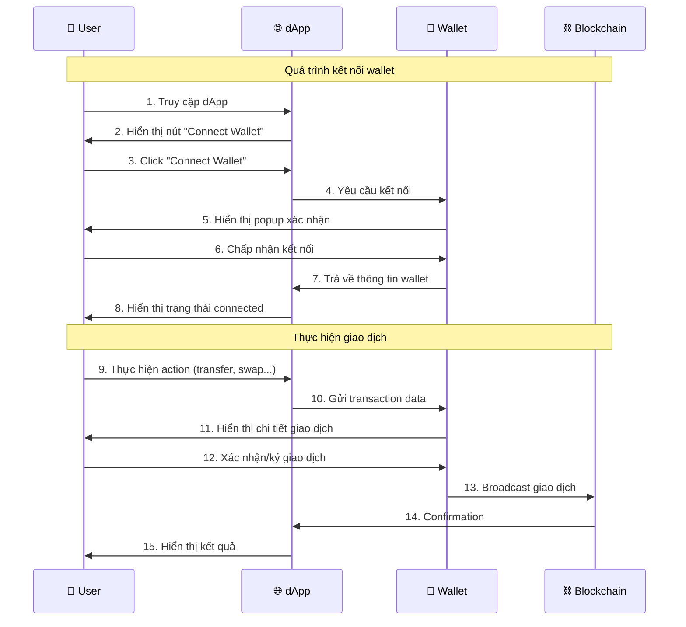
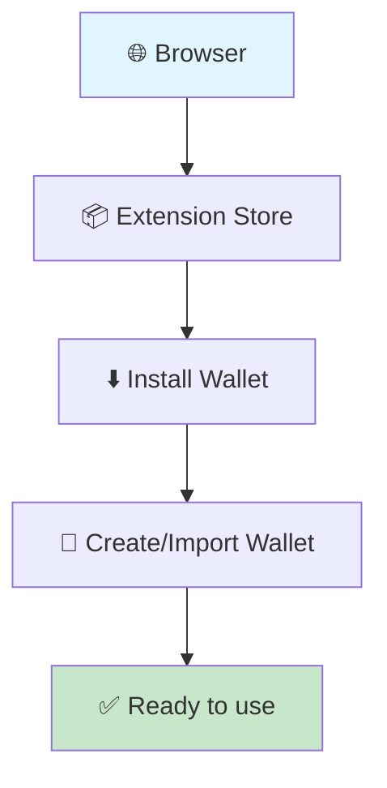
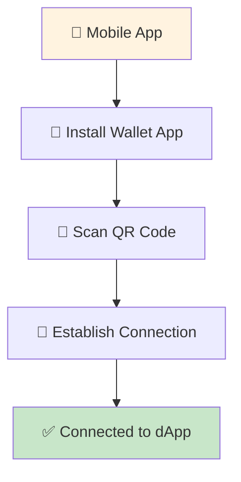
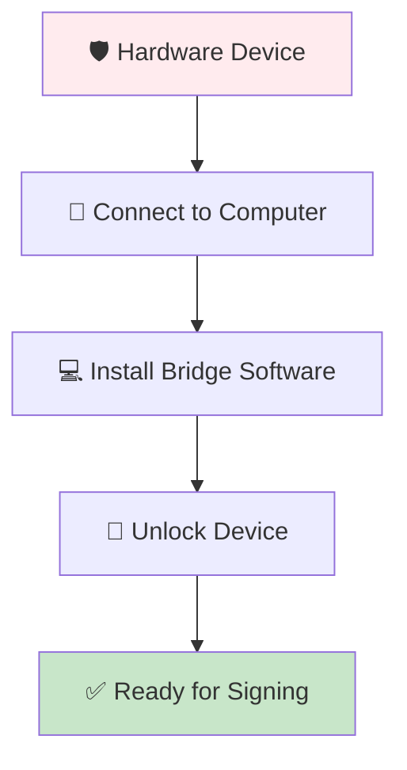
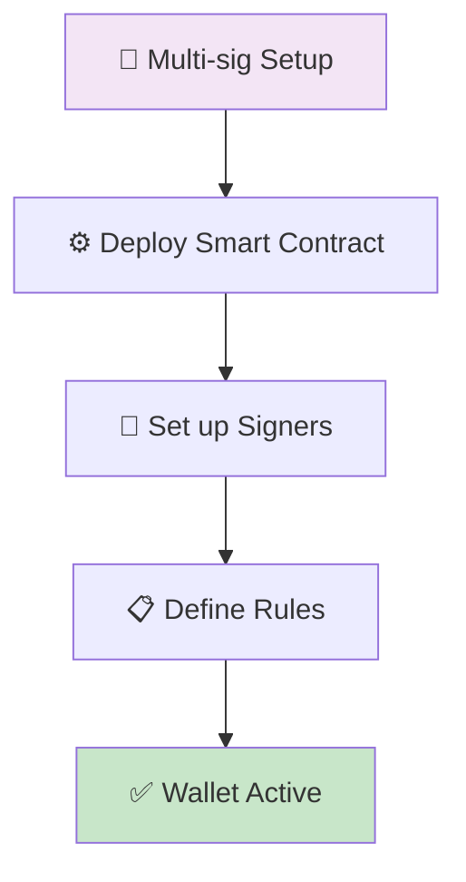
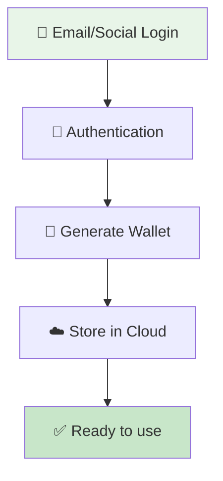
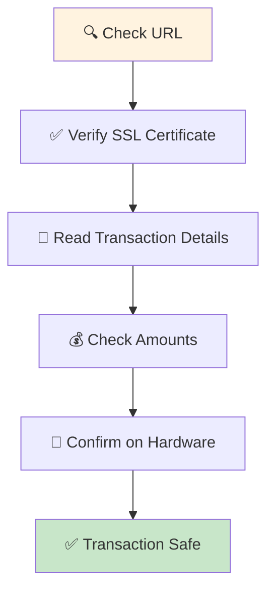

# Lesson 1: Web3 Wallet Connect - Hướng dẫn từ cơ bản đến nâng cao 🚀

## 📚 Giới thiệu

Chào mừng bạn đến với lesson đầu tiên trong hành trình Web3! Trong lesson này, chúng ta sẽ tìm hiểu về **Wallet Connect** - cầu nối quan trọng giữa ứng dụng Web3 (dApp) và ví tiền điện tử (wallet) của người dùng.

## 🎯 Mục tiêu học tập

Sau khi hoàn thành lesson này, bạn sẽ:
- Hiểu được **wallet là gì** và tại sao nó quan trọng trong Web3
- Nắm vững **cơ chế hoạt động** của wallet connect
- Biết cách **phân loại** và **sử dụng** các loại wallet phổ biến
- Hiểu được **security** và **best practices** khi làm việc với wallet
- Có thể **implement** tính năng wallet connect trong dApp

## 🤔 Wallet là gì?

Trong Web3, **wallet** (ví) không chỉ đơn giản là nơi lưu trữ tiền điện tử. Nó là:

- 🔑 **Quản lý khóa riêng tư** (private key) của bạn
- 🆔 **Danh tính số** của bạn trên blockchain
- 📝 **Công cụ ký giao dịch** (transaction signing)
- 🔐 **Cổng bảo mật** để tương tác với dApps

### Ví dụ thực tế
Hãy tưởng tượng wallet như **chìa khóa nhà** của bạn:
- **Địa chỉ wallet** = Địa chỉ nhà (công khai, ai cũng có thể biết)
- **Private key** = Chìa khóa (bí mật, chỉ bạn có)
- **Transaction** = Mở cửa ra vào nhà

## 🔄 Cơ chế hoạt động của Wallet Connect



## 📱 Các loại Wallet phổ biến

### 1. 🌐 Browser Extension Wallets

**Đặc điểm**: Cài đặt như extension trên trình duyệt



#### **MetaMask** 🦊
- **Ưu điểm**: Phổ biến nhất, hỗ trợ nhiều blockchain
- **Nhược điểm**: Chỉ hoạt động trên desktop
- **Sử dụng**: Tốt cho developer và user có kinh nghiệm

#### **Coinbase Wallet** 🔵
- **Ưu điểm**: Interface thân thiện, tích hợp exchange
- **Nhược điểm**: Ít tính năng advanced
- **Sử dụng**: Tốt cho người mới bắt đầu

#### **Brave Wallet** 🦁
- **Ưu điểm**: Built-in browser, privacy-focused
- **Nhược điểm**: Chỉ hoạt động trên Brave browser
- **Sử dụng**: Tốt cho user quan tâm privacy

### 2. 📱 Mobile Wallets

**Đặc điểm**: Ứng dụng mobile, kết nối qua WalletConnect



#### **MetaMask Mobile** 📱
- **Ưu điểm**: Sync với extension, full features
- **Nhược điểm**: Hơi phức tạp cho user mới
- **Sử dụng**: Tốt khi đã quen MetaMask desktop

#### **Trust Wallet** 💙
- **Ưu điểm**: Hỗ trợ nhiều blockchain, DeFi built-in
- **Nhược điểm**: Interface đôi khi lag
- **Sử dụng**: Tốt cho multi-chain users

#### **Rainbow Wallet** 🌈
- **Ưu điểm**: UI/UX đẹp, ETH-focused
- **Nhược điểm**: Ít blockchain được hỗ trợ
- **Sử dụng**: Tốt cho Ethereum ecosystem

### 3. 🛡️ Hardware Wallets

**Đặc điểm**: Thiết bị vật lý, bảo mật cao nhất



#### **Ledger** 📟
- **Ưu điểm**: Bảo mật cao, hỗ trợ nhiều coins
- **Nhược điểm**: Phải mang theo, có phí
- **Sử dụng**: Tốt cho hodlers, amounts lớn

#### **Trezor** 🔒
- **Ưu điểm**: Open source, có màn hình
- **Nhược điểm**: Ít coins hơn Ledger
- **Sử dụng**: Tốt cho tech-savvy users

### 4. 🔐 Smart Contract Wallets

**Đặc điểm**: Logic phức tạp, tính năng nâng cao



#### **Safe (Gnosis Safe)** 🏦
- **Ưu điểm**: Multi-signature, governance features
- **Nhược điểm**: Phức tạp setup, có gas fees
- **Sử dụng**: Tốt cho teams, organizations

#### **Argent** 🛡️
- **Ưu điểm**: Social recovery, gasless transactions
- **Nhược điểm**: Ít được adopt
- **Sử dụng**: Tốt cho mainstream users

### 5. 📧 Embedded Wallets

**Đặc điểm**: Tích hợp trong dApp, không cần install



#### **Email Wallets**
- **Ưu điểm**: Dễ sử dụng, không cần setup
- **Nhược điểm**: Ít control, phụ thuộc service
- **Sử dụng**: Tốt cho onboarding users mới

## 🔒 Security và Best Practices

### ⚠️ Các rủi ro thường gặp

1. **Phishing Attacks** 🎣
   - Fake websites giống y hệt dApp thật
   - **Cách phòng tránh**: Luôn check URL cẩn thận

2. **Private Key Exposure** 🔑
   - Lưu private key không an toàn
   - **Cách phòng tránh**: Không bao giờ share private key

3. **Approval Scams** ✅
   - Approve unlimited tokens cho contracts
   - **Cách phòng tránh**: Chỉ approve amount cần thiết

### 🛡️ Security Checklist



## 💻 Implementation với Reown AppKit

### Cài đặt cơ bản

```bash
npm install @reown/appkit
```

### Code example

```typescript
import { createAppKit } from '@reown/appkit'
import { mainnet, arbitrum } from '@reown/appkit/networks'

// 1. Setup AppKit
const appkit = createAppKit({
  adapters: [/* adapters */],
  networks: [mainnet, arbitrum],
  metadata: {
    name: 'My dApp',
    description: 'My dApp description',
    url: 'https://mydapp.com',
    icons: ['https://mydapp.com/icon.png']
  },
  projectId: 'YOUR_PROJECT_ID'
})

// 2. Connect wallet
async function connectWallet() {
  try {
    await appkit.open()
    console.log('Wallet connected!')
  } catch (error) {
    console.error('Connection failed:', error)
  }
}

// 3. Get account info
function getAccount() {
  const account = appkit.getAccount()
  console.log('Address:', account.address)
  console.log('Chain:', account.chainId)
}

// 4. Send transaction
async function sendTransaction() {
  const account = appkit.getAccount()
  
  if (!account.isConnected) {
    throw new Error('Wallet not connected')
  }

  const tx = await account.sendTransaction({
    to: '0x742d35Cc6969C7D9B5b1b61a7e1c5f9e5e9a1234',
    value: '0.01', // ETH
    data: '0x' // Contract call data
  })
  
  console.log('Transaction hash:', tx.hash)
}
```

## 🧪 Testing Strategy

### Test Cases cần cover

1. **Connection Flow** ✅
   - Successful connection với từng loại wallet
   - Connection rejection handling
   - Network switching

2. **Transaction Flow** 💸
   - Send ETH transaction
   - Contract interaction
   - Transaction confirmation

3. **Error Handling** ⚠️
   - Network errors
   - User rejection
   - Insufficient funds

4. **Security Testing** 🔒
   - Signature verification
   - Permission management
   - Session security

### Sample test với Playwright

```typescript
import { test, expect } from '@playwright/test'

test('should connect MetaMask wallet', async ({ page }) => {
  // 1. Navigate to dApp
  await page.goto('http://localhost:3000')
  
  // 2. Click connect wallet
  await page.click('[data-testid="connect-wallet"]')
  
  // 3. Select MetaMask
  await page.click('[data-testid="metamask-option"]')
  
  // 4. Handle MetaMask popup (need extension setup)
  // This requires MetaMask test setup
  
  // 5. Verify connection
  await expect(page.locator('[data-testid="wallet-address"]')).toBeVisible()
})
```

## 🚀 Hands-on Lab

### Bước 1: Setup Environment
```bash
# Clone project
git clone [project-url]
cd lessons/001-connect-wallet

# Install dependencies
npm install

# Start development server
npm run dev
```

### Bước 2: Install Test Wallets
1. **MetaMask**: https://metamask.io/download/
2. **Coinbase Wallet**: https://wallet.coinbase.com/
3. **Mobile wallets**: Download từ app store

### Bước 3: Practice Exercises
1. Connect với ít nhất 3 loại wallet khác nhau
2. Test trên cả desktop và mobile
3. Thử các error scenarios
4. Implement custom connect button

## 📖 Resources để học thêm

### Documentation
- [Reown AppKit Docs](https://docs.reown.com/appkit) - Official documentation
- [WalletConnect Protocol](https://docs.walletconnect.com/) - Protocol specs
- [EIP-712](https://eips.ethereum.org/EIPS/eip-712) - Structured signatures

### Tutorials
- [MetaMask Integration Guide](https://docs.metamask.io/guide/) - Detailed MetaMask guide
- [Web3 Security Best Practices](https://consensys.github.io/smart-contract-best-practices/) - Security guidelines

### Tools
- [Wallet Test Suite](https://test.walletconnect.com/) - Test different wallets
- [ChainList](https://chainlist.org/) - Network configurations
- [Etherscan](https://etherscan.io/) - Transaction explorer

## ❓ FAQ

### Q: Wallet nào tốt nhất cho người mới?
**A**: Coinbase Wallet hoặc MetaMask. Coinbase dễ dùng hơn, MetaMask có nhiều tính năng hơn.

### Q: Có cần hardware wallet không?
**A**: Nếu bạn hold amounts lớn (>$1000), nên có hardware wallet để bảo mật.

### Q: Mobile wallet có an toàn không?
**A**: An toàn nếu download từ official store và không jailbreak/root device.

### Q: Làm sao biết dApp có an toàn?
**A**: Check domain, đọc smart contract, xem audit reports, community feedback.

## 🎯 Next Steps

Sau khi hoàn thành lesson này:
1. **Practice** với different wallets
2. **Build** một dApp đơn giản có wallet connect
3. **Learn** về transaction types và gas optimization
4. **Explore** DeFi protocols và cách interact

---

## 📝 Ghi chú implementation

> **⚠️ Lưu ý**: Source code chi tiết sẽ được implement và bổ sung trong folder `features/`. Hiện tại đây là phiên bản training overview.

### Cấu trúc source code sẽ có:
```
features/
├── connect-wallet.feature          # Core wallet connection flows
├── wallet-security.feature         # Security testing scenarios  
├── wallet-performance.feature      # Performance & UX testing
├── step-definitions/              # Test implementation
└── examples/                      # Code examples
```

Happy learning! 🎉 Chúc bạn thành công trong hành trình Web3! 🚀 